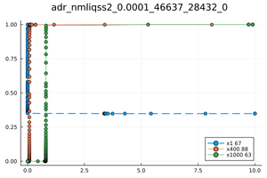
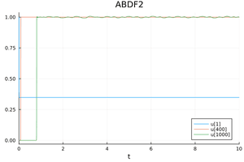
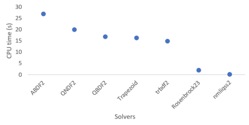

# ADR problem


The Advection diffusion reaction  equations describe many processes that include heat transfer, chemical reactions and many phenomena in areas of environmental sciences. They are ordinary differential equations that resulted from the method of lines (MOL). The resulting system in Eq.(\ref{ADREq}) is a stiff system with possible large entries outside the main diagonal. :
```math
\begin{align*}
& \text{For} \; i=1...N-1  \quad \quad  \dot u_i=-a\frac{u_i-u_{i-1}}{\Delta x}+d\frac{u_{i+1}-2u_i+u_{i-1}}{\Delta x^2}+r(u_i^2-u_i^3) \nonumber \\
& \dot u_N=-a\frac{u_N-u_{N-1}}{\Delta x}+d \frac{2u_{N-1}-2u_N}{\Delta x^2}+r(u_N^2-u_N^3)
\end{align*}
```
where N is the number of grid points and $\Delta x=\frac{10}{N}$ is the grid width after the discretization of the problem with the MOL, $a$ is the advection parameter, $d$ is the diffusion parameter, and $r$ is the reaction parameter. The initial condition is given by:


```math
\begin{align*}
&  u_i(t=0)= 1 \;\;\;\;\; if \;\;\; i \in [1,N/3]\\
& u_i(t=0)= 0 \;\;\;\; else
\end{align*}
```

The advection parameter is fixed at $a=1$, and the reaction parameter is fixed at $r=1000$. The number of grid points is picked as $N=1000$, and $d$ is set to 0.1.
see [[1]](@ref refs4) and [[1]](@ref refs4) for more details.

The QuantizedSystemSolver code to solve this system:
```julia
using QuantizedSystemSolver
function adr(du,u,p,t)# api requires four args
    _dx=100.0
    a=1.0
    d=0.1
    r=1000.0
    du[1] = -a*_dx*(u[1]-0.0)+d*_dx*_dx*(u[2]-2.0*u[1]+0.0)+r*u[1]*u[1]*(1.0-u[1]) 
    for k in 2:999  
        du[k]=-a*_dx*(u[k]-u[k-1])+d*_dx*_dx*(u[k+1]-2.0*u[k]+u[k-1])+r*u[k]*u[k]*(1.0-u[k]) ;
    end 
    du[1000]=-a*_dx*(u[1000]-u[999])+d*_dx*_dx*(2.0*u[999]-2.0*u[1000])+r*u[1000]*u[1000]*(1.0-u[1000]) 
end
tspan = (0.0,10.0)
u0=zeros(1000)
u0[1:333].=1.0
#Construct the problem
odeprob = ODEProblem(adr,u0,tspan)
#Solve the problem
sol=solve(odeprob,nmliqss2(),abstol=1e-3,reltol=1e-2)
p1=plot(sol,idxs=[1,400,1000],title="---");
savefig(p1, "adr$(nmliqss2())") 
```




This is a great example to compare QSS methods against classic integration methods, because it is a large sparse system.
Replace nmliqss2 by solvers such as ABDF2(), QNDF2(), QBDF2(), Rosenbrock23, or Trapezoid() from the DifferentialEquations.jl. Using @btime from BenchmarkTools.jl, we obtain the following results.

|Solver   | @btime  |
|---|---|
|nmliqss2 using @NLodeProblem   |  98.782 ms (10205 allocations: 2.13 MiB)  |   
|nmliqss2 using ODEProblem:    |  340.980 ms (270008 allocations: 13.22 MiB)  | 
|Rosenbrock23:    |  2.315 s (2348 allocations: 29.37 MiB)  |   


Other DifferentialEquations.jl solvers are tested and the following plot shows the their @btime.



In addition order1 is compared against the ImplicitEuler with a reference solution using an absolute
tolerance abstol = 10−12 and relative tolerance reltol = 10−8 using the solver Feagin14 (aRunge-Kutta method of order14) :

|Solver   | @btime  | Relative Error
|---|---|---|
|nmliqss1 using @NLodeProblem   |  94.99 ms  | 0.0268  |
|Implicit Euler:    |   13134 ms |  0.0572 |


The following code is used:
```julia
function getAverageErrorByRefs(solVec::Vector{Vector{Float64}},solRef::Vector{Any},T::Int,numPoints::Int)
    allErrors=0.0
    for index=1:T
        sumTrueSqr=0.0
        sumDiffSqr=0.0
        relerror=0.0
        for i = 1:numPoints #
            ts=solRef[i][index]
            Ns=solVec[i][index]
            sumDiffSqr+=(Ns-ts)*(Ns-ts)
            sumTrueSqr+=ts*ts
        end
        relerror=sqrt(sumDiffSqr/sumTrueSqr)
        allErrors+= relerror
    end
    return allErrors/T
  end
BSON.@load "test/solVectAdvection_N1000d01_Feagin14e-12.bson" solFeagin14VectorN1000d01
sol=solve(odeprob,ImplicitEuler(),saveat=0.01,abstol=1e-2,reltol=1e-1)
err2=getAverageErrorByRefs(sol.u,solFeagin14VectorN1000d01,1000,1000)
```


## [References](@id refs4)

[1] F. Bergero, J. Fernandez, E. Kofman, and M. Portapila. Time discretization versus state ´
quantization in the simulation of a 1d advection-diffusion-reaction equation. Simulation:
Transactions of the Society for Modeling and Simulation International, vol.92(no.1):pp.47–
61, 2016.

[2]  F. Pietro, G. Migoni, and E. Kofman. Improving linearly implicit quantized state system
methods. Simulation: Transactions of the Society for Modeling and Simulation International,
vol.95(no.2):pp.127–144, 2019.