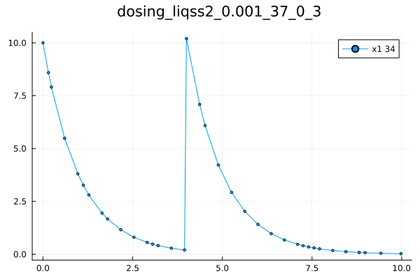

# Conditional Dosing in Pharmacometrics

This section shows [the Conditional Dosing in Pharmacometrics](https://docs.sciml.ai/DiffEqDocs/stable/examples/conditional_dosing/) example tested using the Tsit5() of the DifferentialEquations.jl

```julia
using Plots
using DifferentialEquations
function f(du,u,p,t) 
    du[1] =-u[1]
end 
u0 = [10.0]
tspan=(0.0,10.0)
prob = ODEProblem(f, u0, tspan)
condition(u, t, integrator) = t == 4 && u[1] < 4
affect!(integrator) = integrator.u[1] += 10
cb = DiscreteCallback(condition, affect!)
sol=solve(prob, Rosenbrock23(), callback = cb,abstol=1e-3,reltol=1e-2)
p1=plot(sol);
savefig(p1, "dosing---")
```


The same problem is handled using QuantizedSystemSolver. First, the differential equation is defined. Then we have two conditions t == 4 && u[1] < 4 that can be replaced by using another discrete variable p (flag) that is changed when t==4. This change triggers the check of  u[1] < 4.

```julia
using QuantizedSystemSolver
function dosing(du,u,p,t) 
  du[1] =-u[1]
  if t-4.0>0.0
      p[1]=0.0
  end
  if p[1]+(4.0-u[1])>0.0
      u[1]=u[1]+10.0
      p[1]=-1e5
  end
end 
u0 = [10.0]
p=[-1e5]
tspan=(0.0,10.0)
odeprob = ODEProblem(dosing,u0,tspan,p)
sol=solve(odeprob,liqss2(),abstol=1e-3,reltol=1e-2)
p1=plot(sol);
savefig(p1, "dosing---")
```




## Benchmarks


|Solver   | @btime  |
|---|---|
|liqss2 using @NLodeProblem   |  8.33 μs (44 allocations: 3.33 KiB)  |   
|liqss2 using ODEProblem:    |  2.006 ms (3353 allocations: 196.96 KiB)  | 
|Rosenbrock23:    |  31.600 μs (355 allocations: 21.38 KiB)  |   


Comparing the solve method, we get:


```julia
@btime sol=solve($odeprob,liqss2(),abstol=1e-3,reltol=1e-2)
#8.300 μs (44 allocations: 3.34 KiB)
@btime sol=solve($odeprob,Rosenbrock23(),abstol=1e-3,reltol=1e-2)
#22.500 μs (251 allocations: 16.89 KiB)
@btime sol=solve($odeprob,Tsit5(),abstol=1e-3,reltol=1e-2)
#7.775 μs (165 allocations: 12.33 KiB)
```