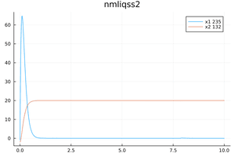
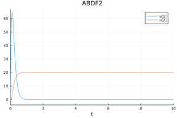

# Linear Time Invariant 
```julia
using QuantizedSystemSolver
function sysb53(du,u,p,t)
    du[1] = -20.0*u[1]-80.0*u[2]+1600.0
    du[2] = 1.24*u[1]-0.01*u[2]+0.2
end
u0 = [-1.0, -2.0];tspan=(0.0,10.0)
#Construct the problem
odeprob = ODEProblem(sysb53,u0,tspan)
#Solve the problem
sol = solve(odeprob,nmliqss2())
p1 = plot(sol);
```
Then use DifferentialEquations instead of QuantizedSystemSolver and use solvers such as ABDF2(), QNDF2(), QBDF2(), or Trapezoid() instead of nmliqss2. The plots are displayed below:






This is a great example that shows when we need to use the explicit qss, the implicit liqss, or the modified implicit nmliqss. This is a stiff problem so we need to use the implicit methods, but it also contains larger entries outside the main diagonal of the Jacobian. Therefore, nmliqss should the most appropriate algorithm to use. 

--- 
There is another syntax to define a problem through a macro `@NLodeProblem`as it is shown in the following code.

```jldoctest
using QuantizedSystemSolver

odeprob = @NLodeProblem begin 
        name=(sysb53,)
        u = [-1.0, -2.0]
        du[1] = -20.0*u[1]-80.0*u[2]+1600.0
        du[2] = 1.24*u[1]-0.01*u[2]+0.2
        end 
        tspan=(0.0,10.0)

solqss=solve(odeprob,qss2(),tspan);
solliqss=solve(odeprob,liqss2(),tspan);
solnmliqss=solve(odeprob,nmliqss2(),tspan);
(solqss.stats.totalSteps,solliqss.stats.totalSteps,solnmliqss.stats.totalSteps)


# output

(1424, 1468, 367)

```
