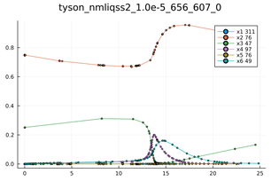
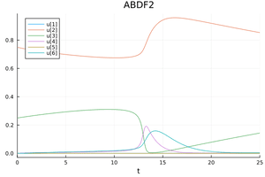

# The Tyson Model
This is a model that is of a great interest in the field of biology. The Tyson model describes the mechanism of a cell: the division, the growth, and the interactions amongst its components. The model contains six components ($C2,CP,pM,M,Y,YP$), which are the variables of the following system of equations:
```math
\begin{align*}
& \frac{C2}{dt}=k_6 M-k_8 C2 + k_9 CP\nonumber\\
& \frac{CP}{dt}=k_3 CP Y+ k_8 C2 - k_9 CP\nonumber\\
& \frac{pM}{dt}=k_3 CP Y- pM (k_10+k_4 \frac{M}{(C2+CP+pM+M)})^2 + k_5 M\nonumber\\
& \frac{M}{dt}= pM (k_10+k_4 \frac{M}{(C2+CP+pM+M)})^2 + k_5 M -k_6 M\nonumber\\
& \frac{Y}{dt}= k_1-k_2 Y -k_3 CP Y\nonumber\\
& \frac{YP}{dt}= k_6 M-k_7 YP
\end{align*}
```
where $k_i$ are parameters, and the model variation that was tested in this article uses these values:
$k_1=0.015;k_2=0;k_3=200;k_4=180;k_5=0;k_6=1;k_7=0.6;k_8=10^6;k_9=10^3;k_{10}=0.018$.
see [[1]](@ref refs5) and [[2]](@ref refs5) for more details.

The QuantizedSystemSolver code to solve this system:
```julia
using QuantizedSystemSolver
function tyson(du,u,p,t)
    k_1=0.015;k_3=200.0;k_4=180.0;k_7=0.6;k_8=1e6;k_9=1e3;k_10=0.018
    du[1] = u[4]-k_8*u[1]+k_9*u[2]
    du[2] =-k_3*u[2]*u[5]+k_8*u[1]-k_9*u[2]
    du[3] = k_3*u[2]*u[5]-u[3]*(k_10+k_4*(u[4]/(u[1]+u[2]+u[3]+u[4]))^2)
    du[4] =u[3]*(k_10+k_4*(u[4]/(u[1]+u[2]+u[3]+u[4]))^2)-u[4]
    du[5] = k_1-k_3*u[2]*u[5]
    du[6] =u[4]-k_7*u[6]
end
u0 = [0.0,0.75,0.25,0.0,0.0,0.0];tspan=(0.0,25.0)
#Construct the problem
odeprob = ODEProblem(tyson,u0,tspan)
#Solve the problem
sol=solve(odeprob,nmliqss2())
p1=plot(sol);
savefig(p1, "tyson_$(nmliqss2())") 
```
Replace nmliqss2 by ABDF2() from the DifferentialEquations.jl, to obtain the following plots.





 ## [References](@id refs5)

[1] J. Tyson. Modeling the cell division cycle: cdc2 and cyclin interactions. Proceedings of the
National Academy of Sciences, vol.88:pp.7328–7332, 1991.


[2]  F. Pietro, G. Migoni, and E. Kofman. Improving linearly implicit quantized state system
methods. Simulation: Transactions of the Society for Modeling and Simulation International,
vol.95(no.2):pp.127–144, 2019.