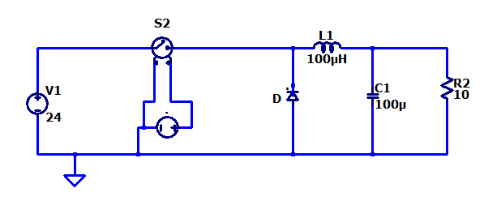
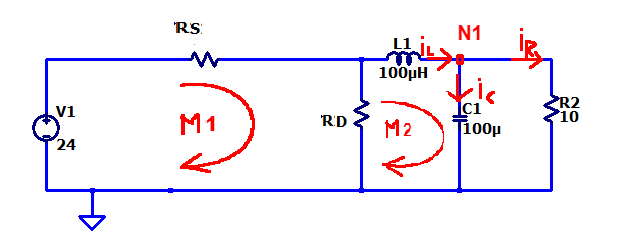
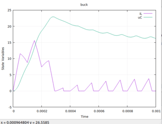
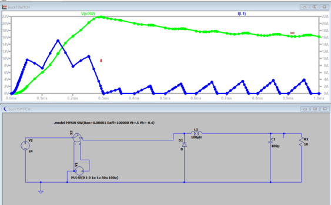
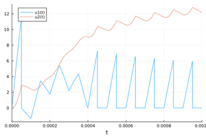

# Tutorial

The API was designed to match the differentialEquations.jl interace. The only difference is in the way we define events. The problem is defined inside a function, in which the user may introduce any parameters, variables, equations, and events:
```julia
function func(du,u,p,t) 
  #parameters
  #helper expressions
  #differential equations
  #if-statments for events 
end
```

Then, this function is passed to the `ODEProblem` function along with the initial conditions, the time span, and any parameters or discrete variables. 
```julia
tspan=(initial_time,final_time)
u = [u1_0,u2_0...]
p = [p1_0,p2_0...]
odeprob=ODEProblem(func,u,tspan,p)
```

The output of the previous function, which is a QSS problem, is passed to a solver function with other configuration arguments
such as the algorithm type and the tolerance. The solve
function dispatches on the given algorithm and start the numerical
integration.
```julia
sol= solve(odeprob,algorithm,abstol=...,reltol=...)    
```
A the end, a solution object is produced that can be queried, plotted, and error-analyzed.

## Solving a Nonlinear ODE Problem with events in Julia
In this section, we will go through the process of setting up, solving, querying, and plotting a non linear system of ordinary differential equation (ODEs) with events. We will use a buck converter circuit model as an example.

### Example: Buck circuit
[The Buck](https://en.wikipedia.org/wiki/Buck_converter) is a converter that decreases voltage and increases current with a greater power efficiency than linear regulators. Its circuit is shown in the following figure:





The diode and the switch can be modeled as two variables resistors $RD$ and $RS$. When the diode and the switch are ON, $RD$ and $RS$ are set to $10^{-5}$, and they are OFF, they are set to $10^{5}$.



First, we look for any differential equations. The relationship between the voltage and the current within the inductor and the capacitor is respectively given by:

$\large \frac{di_l}{dt}=\frac{u_l}{L}$ 

$\large \frac{du_c}{dt}=\frac{i_c}{C}$

The system variables are $i_l$ and $u_c$. Therefore, we have to express the differential equations using only these two variables. i.e. $i_c$ and $u_l$ must be found as functions of $i_l$ and $u_c$. To do this, we conduct a mesh and a nodal analysis to get the relationship between the different components in the circuit.

Using nodal analysis in Node N1, we have $i_c=i_l-i_R=i_l-\frac{u_c}{R}$. Then, we update the differential equation of the capacitor to become: $\large \frac{du_c}{dt}=\frac{i_l-\frac{u_c}{R}}{C}$ 

Using mesh analysis in Mesh 2, we get $u_l=-u_c-u_d=-uc-i_d.RD$. To get rid of $i_d$, we use mesh analysis in Mesh 1 to get:

$V1= RS.i_s-i_d.RD=RS.(i_l-i_d)-i_d.RD$

Thus, $i_d=\frac{RS.i_l-V1}{RS+RD}$

Second, we look for the events, which are defined by the switching of the $RS$ and $RD$. The switch is ON for $0.5$ x $10^{-4}$ seconds and OFF for the same period. The diode is ON when $id>0$

### Problem 

We get the problem discribed inside the function buck. First, we define any constant parameters, then we rename the continuous variables (u[1] and u[2]) and the discrete variables (p[1],p[2],p[3],p[4]) for convenience. $i_d$ can be plugged in the inductor differential equation or can be defined before it. Next, we put the differential euations and events using ``if-statements``.

To match The interface of differentialEquations.jl, the buck function is passed along the initial conditions and the tspan to the ODEProblem function. the result is an ODE problem that is sent to the solve function.

The buck problem can be solved by the following user code:

```julia
using QuantizedSystemSolver
function buck(du,u,p,t)
  #Constant parameters
  C = 1e-4; L = 1e-4; R = 10.0;V1 = 24.0; T = 1e-4; DC = 0.5; ROn = 1e-5;ROff = 1e5;
  #Optional rename for convenience
  RD=p[1];RS=p[2];nextT=p[3];lastT=p[4];il=u[1] ;uc=u[2]
  #Equations
  id=(il*RS-V1)/(RD+RS) # diode's current
  du[1] =(-id*RD-uc)/L
  du[2]=(il-uc/R)/C
  #Events
  if t-nextT>0.0
    lastT=nextT;nextT=nextT+T;RS=ROn
  end
  if t-lastT-DC*T>0.0
    RS=ROff
  end
  if id>0
    RD=ROn;
  else
    RD=ROff;
  end
end
#Initial conditions and time settings
p = [1e5,1e-5,1e-4,0.0];u0 = [0.0,0.0];tspan = (0.0,0.001)
#Define the problem
prob = ODEProblem(buck,u0,tspan,p)
```

### Solve
The solve function takes the previous problem (prob) with a chosen algorithm (qss1,qss2,liqss1,liqss2,nmliqss1,nmliqss2) and some simulation settings, and it outputs a solution (sol).

```julia
sol= solve(prob,nmliqss2(),abstol=1e-3,reltol=1e-2)
```

### Query the solution

The values of all variables  at time 0.0005:

```julia
sol(0.0005)
#[-0.0001274906262221241, 19.430164566823173]
```

 The value of variable 2  at time 0.0005:

```julia
sol(2,0.0005)
#19.430164566823173
sol(0.0005,idxs=2)
#19.430164566823173
```

 The total number of steps to end of the simulation:

```julia
sol.stats.totalSteps
#305
```

 The number of simultaneous steps during the simulation:

```julia
sol.stats.simulStepCount
#88
```

 The total number of events during the simulation:

```julia
sol.stats.evCount
#80
```

The actual data is stored in two vectors:

```julia
sol.savedTimes
sol.savedVars
```

### Plot the solution

If users want to plot the solution, they can use:

```julia
plot(sol)
```

The plot function accepts other arguments such as xlims,ylims,legend,marker, and title. The user can also plot only certain variables (Users can put as many as they want) using:

```julia
plot(sol,idxs=[i,j])# i and j are the indices of the variables (type int).
plot(sol,i,j)# this is equivalent to the previous line.
```

Plotting a variable $i$ with respect to another $j$ is also possible via:

```julia
plot(sol,idxs=(i,j))# i and j should be replaced by the desired variable indices.
```

It is also possible to plot the sum of some variables (Users can put as many as they want) using:

```julia
plot_SolSum(sol,i,j)#i and j are the indices of the variables (type int).
```

 Finally, if the user wants to save the plot to a png file:

```julia
save_Sol(sol)
save_SolSum(sol,i,j)
```
**Buck plot using QuantizedSystemSolver.jl**


To compare the results of this system against classic methods, an attempt to use the package DifferentialEquations.jl. However, currently DifferentialEquations.jl can not handle this problem. An [issue](https://github.com/SciML/DifferentialEquations.jl/issues/998) is pending.
Other tools are used to validate the QuantizedSystemSolver.jl in this buck converter are ``ltspice`` and the [C qss-solver](https://github.com/CIFASIS/qss-solver), and the results are also shown in the following plots:

 **Buck plot using qssC**



 **Buck plot using ltspice**




**Buck plot using DifferentialEquations.jl**




### Error Analysis

To explain the error analysis, we shall use the sin and cos functions:

```julia
function sincos(du,u,t)
  du[1] = u[2]
  du[2] = -u[1]
end
tspan=(0.0,10.0)
u0 = [0.0,1.0]
prob = ODEProblem(sincos,u0 ,tspan)
sol= solve(prob,nmliqss2(),abstol=1e-3,reltol=1e-2)
```

Since in QSS all variables are updated independently, we can interpolate all values at specific intervals to obtain a solution similar to that of classic methods using solInterpolated(sol,saveat) where saveat is a fixed step size.

```julia
solInterp=solInterpolated(sol,0.01)
```

To find the relative error we use: $err=\sqrt{\frac{\sum(sol_i-T_i)^2}{\sum(T_i)^2}}$ , where T is true or reference solution.

#### Error against an analytic function
To compute the error against an analytic solution, we use **getError**(solInterp,index,analytic function)

```julia
err1=getError(solInterp,1,x->sin(x))
err2=getError(solInterp,2,x->cos(x))
(err1+err2)/2
#0.029546046862124274
```

The analytic functions can be passed altogether to get the average error at once:  **getAverageError**(solInterp,vector of analytic functions)

```julia
err=getAverageError(solInterp,[x->sin(x),x->cos(x)])
#0.029546046862124274
```

#### Error against an reference solution

Similarly, we compute the error against a reference solution using **getErrorByRefs** to get the error for one variable and **getAverageErrorByRefs** to get the average error. Here, the reference solution is stored in a vector that contains the values of all variables. it is the $u$ vector for the case of the solution from the differentialEquations.jl:

```julia
solFeagin14 = solve(prob,Feagin14(),saveat=0.01,abstol = 1e-12, reltol = 1e-8)
solFeagin14Vector=solFeagin14.u
error1=getErrorByRefs(solInterp,1,solFeagin14Vector)
avgError=getAverageErrorByRefs(solInterp,solFeagin14Vector)
```

The results of some solvers of QuantizedSystemSolver.jl are compared against some solvers from DifferentialEquations.jl in the examples section.

